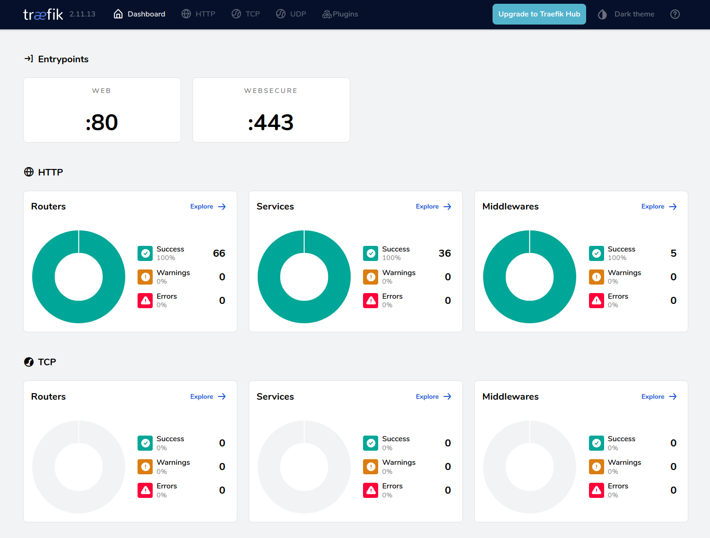

# TP Utilisation de docker

Objectifs : 
- Apprendre à conteneuriser des applications simples ou complexes avec `docker` et Docker-compose,
- déployer ces applications sur un VPS, utiliser un `application Proxy` (Traefik) pour gérer l'accès aux services conteneurisés.
- Exposer de manière efficace et sécurisée des applications conteneurisées sur le web.

Pré-requis :
- Git
- Notions de base en ligne de commande Linux
- Notions de base en `docker` et Docker-compose
- Avoir un environnement de développement fonctionnel (Linux, MacOS ou Windows WSL2)

## Consignes générales

- Cloner le TP sur votre machine
- Tous vos travaux devront être versionnés avec Git et rendu via votre fork (envoi du lien du dépôt par mail `anthony.geourjon@tetras-libre.fr`).
- N'hésitez pas à faire de nombreux commits afin de revenir plus facilement en arrière si nécessaire
- L'énoncé sert également de fichier de compte rendu pour les questions `--> À compléter`
- Un VPS (Debian) pourra vous être fourni pour le déploiement des applications

```bash
git clone https://gitlab.tetras-libre.fr/formation-epsi/tp-conteneurisation-public.git
cd tp-conteneurisation-public
git remote set-url origin <votre_url_de_depot_gitlab_ou_github> # je vous conseille GitHub via SSH
git push -u origin main
```

## Partie 0 : Mise en jambe

- Installer `docker` et `docker-compose` sur votre machine locale si vous ne l'avez pas déjà
- Lancer `docker run hello-world` pour vérifier que votre installation fonctionne bien
- FACULTATIF : Installer l'outil `ctop` (top like pour docker)
- FACULTATIF : Installer l'outil `lazydocker` (interface TUI pour docker)


## Partie 1 : `Docker` et `Docker-compose` the simple way

- Installer localement l'app `react-hello` et vérifier que tout fonctionne bien
    ```bash
    cd P1/react-hello
    npm install
    npm run dev
     ```
- Créer une image `Docker` avec une l'app front Hello world en React (Utilisation de Dockerfile)
  - On prendra soin de ne pas inclure des fichiers et dossiers inutiles dans l'image (fichier `.dockerignore`)
- Construire l'image en local, crée un conteneur l'utilisant et accéder à l'app

*********************
→ À compléter : Fournir les commandes utilisées
**********************

- Écrire un fichier `docker-compose.yml` permettant de déployer cette application

- Publier votre image sur Dockerhub

**********************
→ À compléter : Fournir l'URL de votre image sur Dockerhub
**********************

- Optimiser la taille de votre image avec `docker-slim` et la publier sur Dockerhub
   - `docker-slim` est un outil qui permet d'optimiser la taille des images Docker. 
   - Il semble ne pas être disponible sous Windows. Si c'est votre cas, passer la question.

**********************
→ À compléter : Fournir URL de votre image slim sur Dockerhub et la taille avant/après optimisation
**********************

- Modifier votre fichier `docker-compose.yml` pour que votre app utilise l'image Dockerhub

- Fournissez dans `P1` le ou les fichiers compose finaux ainsi que le fichier Dockerfile.

## Partie 2 : `Docker` et `Docker-compose` the real way

- L'app de démo `react-hello2` devient un peu plus complexe et utilise maintenant un backend Next.JS et une BDD mariaDB
  - L'app sera composé de 3 conteneur : frontend, un backend et une BDD mariadb
  - La BDD contient des données random
  - Le front end affiche ses données en interrogeant le backend
  - Les secrets doivent être gérés via des variables d'environnements

- Installer localement l'app `react-hello2` et vérifier que tout fonctionne bien
   - frontend 
    ```bash
    cd P2/react-hello2/frontend
    npm install
    npm run dev
     ```
  - Backend
    ```bash
    cd P2/react-hello2/backend
    npm install
    npm run build
    npm run dev
     ```

- Écrire les fichiers `Dockerfile` et  `docker-compose` permettant de déployer cette application
   - Note : Il peut être utile de passer par un multi stage build
- D'éventuels changements dans le code source peuvent être nécessaires pour que l'application fonctionne correctement en conteneurisé

- Supprimer les containers, est-ce que les données sont toujours là ?
  - Utiliser des volumes si ce n'est pas le cas

- Réduisez au maximum les possibilités de contact entre les conteneurs
  - Le front doit pouvoir communiquer avec le back.
  - Le back doit pouvoir communiquer avec la BDD
  - Pas de contact possible entre front et BDD
  - les `links` ne sont pas autorisés, utilisez seulement des `networks`


- Fournissez dans `P2` le ou les fichiers `docker-compose` finaux ainsi que les `Dockerfile` .

## Partie 3 : Conteneuriser des applications existantes

- Choisir 2 ou 3 applications existante non conteneurisée disponible sur Github
  - La complexité de l'application choisie influera la notation
  - Une liste d'application possible est fournie en fin de partie
  - Choisir des applications utilisant des technologies différentes (nodejs, python, ruby, php, go, java, etc.)

**********************
→ Fournir l'URL des dépôts de l'application
→ Décrire les enjeux techniques de la conteneurisation liée à l'application (technologies plus mises à jour, nombreuses dépendances, interconnexion avec d'autres systèmes ...)
**********************

- Écrire l'ensemble des fichiers permettant de déployer ces applications avec Docker, docker-compose

- Critères évalués
  - Build reproductible (npm ci, pip install --no-deps, --frozen-lockfile, etc. selon techno).
  - Pas de secrets commités.
  - Healthcheck présent.
  - Persistence documentée.
  - Exposition réseau minimale, Aucune base de données exposée publiquement.
  - Conteneurs runtime non-root quand praticable.

- Faire une PR de votre travail à l'application choisie

Liste application proposée à conteneuriser, vous pouvez en choisir une autre si vous le souhaitez :
Certaines sont vielles, mal documentées, incompréhensibles, c'est volontaire !

- https://github.com/Systemik-Solutions/glycerine-viewer
- https://github.com/Aikon-platform/aiiinotate
- https://github.com/geogebra/geogebra
- https://github.com/LeedRSS/Leed
- https://github.com/gohugoio/hugo
- https://github.com/usebruno/bruno
- https://github.com/bigprof-software/online-rental-property-manager
- https://github.com/adnodev/adno
- https://github.com/leanderseige/antlitz.ninja
- https://github.com/atomotic/iiif-annotation-studio
- https://github.com/chartes/adele-app
- https://github.com/KirinoSan1/IIIF-Application
- https://github.com/slub/iiif-mirador-wrapper-application
- https://github.com/leanderseige/antlitz.ninja

- Fournissez dans `P3` le ou les fichiers compose finaux.

## Partie 4 BONUS: Utiliser un Application Proxy - Traefik

- Qu'est-ce qu'un Reverse Proxy et à quoi est-ce que ça sert ?
- Qu'est-ce qu'un `Application Proxy` et à quoi est-ce que ça sert ?

**********************
→ À compléter
**********************

- Se connecter en SSH à votre VPS
- Installer `docker` et `docker-compose`
- Lancer `docker run hello-world` pour vérifier que votre installation fonctionne bien
- Connaitre l'URL (FQDN) de votre VPS : `hostname -f`

- Déployer l'application de la partie 1 sur votre VPS
  - L'application doit être accessible via l'IP de votre VPS et les ports classiques (80, 443)
  - Vérifier que tout fonctionne bien

- Installer et déployer Traefik via `Docker` sur votre VPS
  - Voir fichier `memoVPS.md` 
  - Traefik reçoit le trafic sur les ports classiques (80, 443)
  - La page dashboard de Traefik est déployé à *votreURLdeVPS* et vous permet de vérifier que tout fonctionne

  


- Servir l'App Hello world grace à Traefik et à l'URL : p4.*votreURLdeVPS*.
  - L'app doit fonctionner en HTTPS

- Séparer votre fichier `docker-compose.yml` afin d'avoir un mode DEV utilisable en local sans Traefik et un mode PROD fonctionnant sans Traefik
  - Le passage de l'un à l'autre se fera en changeant la variable COMPOSE_FILE de votre `.env`
  - Dev : mapping de port autorisé,
  - Prod : utilisation de Traefik sans mapping de port (à part pour Traefik lui-même)

- Déployer l'application de la partie 2 sur votre VPS
  - L'application doit être accessible à p4-hello2.*votreURLdeVPS* et doit fonctionner en HTTPS

- Fournissez dans `P4` le ou les fichiers compose finaux.


## Partie 5 : Évaluation par les pairs

- Mixer les binômes
- Évaluer les travaux des autres binômes sur les critères suivants :
  - Fonctionnalité : Est-ce que l'application fonctionne correctement en local et sur le VPS
  - Qualité des Dockerfile : Est-ce que les images sont optimisées, sécurisées, maintenables
  - Qualité des fichiers `Docker-compose` : Est-ce que les fichiers sont clairs, bien structurés, sécurisés
  - Documentation : Est-ce que les travaux sont bien documentés, clairs et compréhensibles
  - Commentaires supplémentaires : [Ajouter des commentaires ou suggestions pour améliorer le travail évalué]

## Conclusion

La stack proposée `VPS + `Docker` + `Docker-compose` + Traefik` est suffisante pour une grande majorité d'applications réelles et adaptées à des structures ou projet avec peu de ressources.
- Peu de complexité à mettre en œuvre
- Environnement de dev et de prod avec peu de différence
- Technologie simple et maîtrisée par de nombreuses personnes
- Des possibilités de monitoring presque sans limites avec Traefik
- Peu de dépendances à des services tiers
  - Un hébergeur VPS
  - DockerHub

**********************
→ À completer : Quelles sont les limites de cette approche et votre proposition de remplacement. (Réponse construite d'une dizaine de lignes)
**********************

